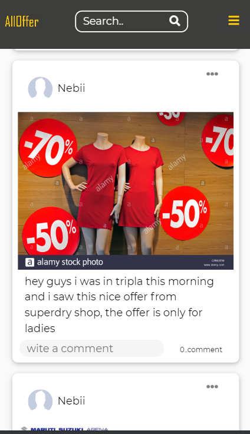
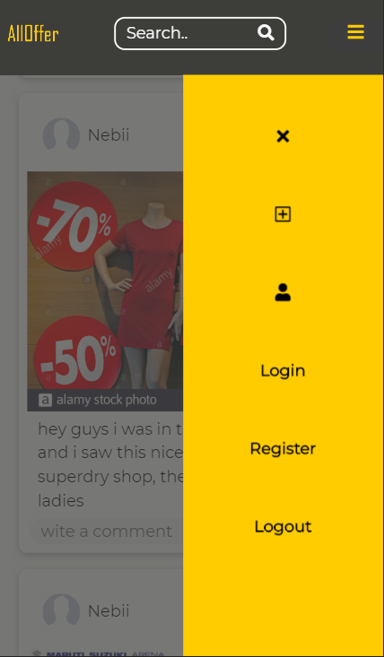
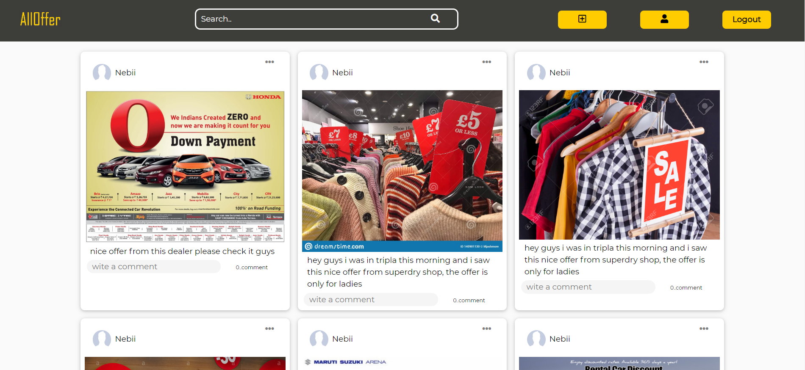

  # alloffer    - web-App                                                    
 
 ------------------------------------------------------

 ## Discription 
 -------------------------------------------------------
- this is a web media sharing app   
- using this app  anonymous user can see the post with out making all deleting a post
  registered users has there own profile, so they can login and see others post plus they can see there profile info and they 
  can also delete thier post 
- the app is responsive and done for both mobile and desktop users 

---

 ## Features  and technologies   
    
 -----------------------------------------------------

 
 |  server  | server os  | app verion  |
 | ---------------- |:-------------:| ----------  |
 |  apache and node express |  Centos 7          |      0-1    |

 
 
 - apache                                          
 - express js 
 - multer
 - vanilla javascript and nodejs  for programming lang 
 - JWT 
 - only html and css 
 

---------------------------------------------------------

## Design pattern 

---------------------------------------------------------

 - Model View Controller

-----------------------------------------------------------

## photos

---------------------

                        

 
 
  
  
  
  -------------------------
  "link to the app 
  
  https://10.114.32.141/alloffer/

